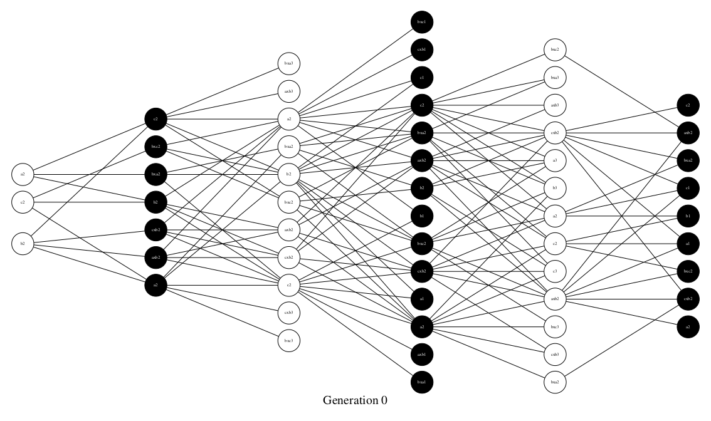
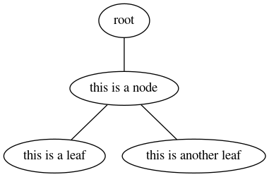
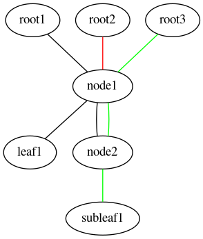

=======================
Nodes, Leaves and Trees
=======================

Trees
=====

The first core concept you'll need to
understand is how Trees work. And no,
I'm not talking about organic trees,
I'm talking about coded trees. If
you run the game, play for a little
while, then check the ``plots`` folder,
you'll see something like this:

Then you may be thinking: *"WTF is this??"*

This, although it may not seem, it is a
coded tree (well, not really, this is in fact
a graphical representation of a coded tree). 
This tree represents all game
movements and its respective children
(the moves that can be made at the given
move state).
TL;DR: A tree is a collection of nodes,
which indicates the last move and the
color that made it, and which moves can
be made after that.

Nodes & Leaves
==============

Nodes are basically variables that store
the last move and all movements that can
be made at the given game state. If you
check the code, you'll see at the ``ai.py``
module, this code piece:

.. literalinclude:: ../../ai.py
    :linenos:
    :language: python
    :lines: 18-46

This code creates instances of Node objects
that store the infos we've already covered.

    *So what?*

Nodes are Node objects that have anything
different than an empty list ([]) as its 
``children`` parameter. When it's not an
empty list, it should be filled with pre
calculated move possibilites, represented
by their respective movecodes.

When the children parameter equals to an
empty list, this means that this node is
an end node, a. k. a. Leaf. What this
really means is that, after this node,
no move can be made anymore, because one
of the sides has won, causing a game reset.

But these concepts are completely realtive
to the move call stack, because a node
can turn into a leaf, and a leaf can turn
into a node, depending on how the game evolves.
Consider this:

In this example, there's only one node and two
leaves, and their role never changes, but in a
game of hexapawn, the roles of nodes and leaves
can change quite a lot, so I'll add some more
nodes and roots, and you'll see what I mean.

As you can see, depending on how the call stack
is filled, the nodes may assume different roles.
The ``node1`` behaves as a node if you're coming
from the ``root1`` or ``root3``, but it becomes
a leaf if you pick ``root2``. The same happens
with ``node2``: it can be a node if you pick
``root3``, but it becomes a leaf if you pick
``root1``.